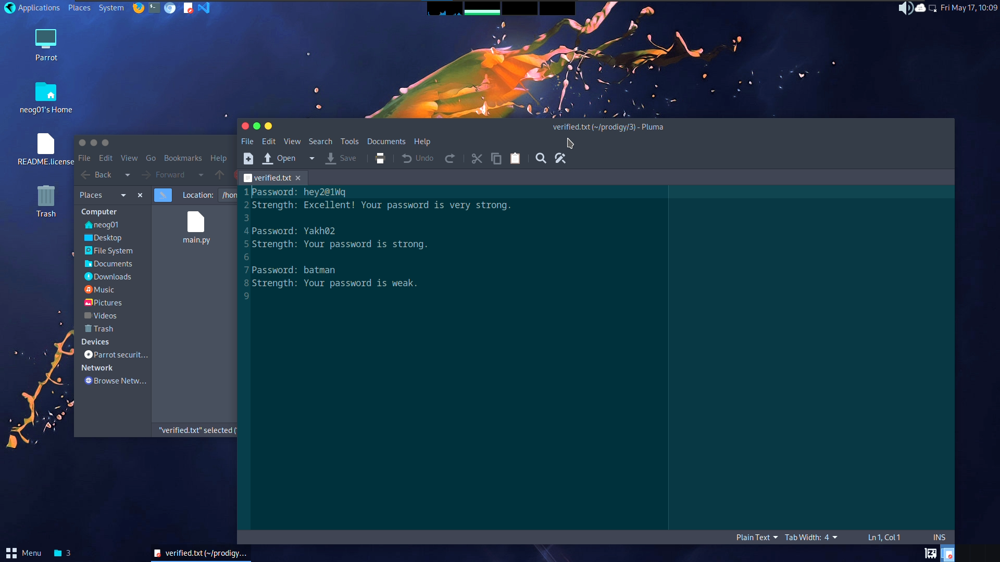

# Password Complexity Checker
> Prodigy InfoTech Internship (Task_03)

* Create a python program that can provide feedback to the password string given by the user according to their password strengths.

```

  "Author": "Shourya Gupta",
  "Language": "Python",

```
***
## Task list
- [x] Create a choice for the user for checking the complexity of the password string and exiting the program.
- [ ] Take the user inputed password.
- [ ] Display the predefined remarks along with the appropriate colour of the text.
- [ ] Store the data in a ``` verified.txt ``` file for future reference.
- [ ] Give users the choice to perform the checking operation again or exit the program.
- [ ] Save the verified.txt file in the same directory of the program.

## Dependencies

```
pip install re colorama
```
---
## Output Snapshot
<p align="center"></p>
